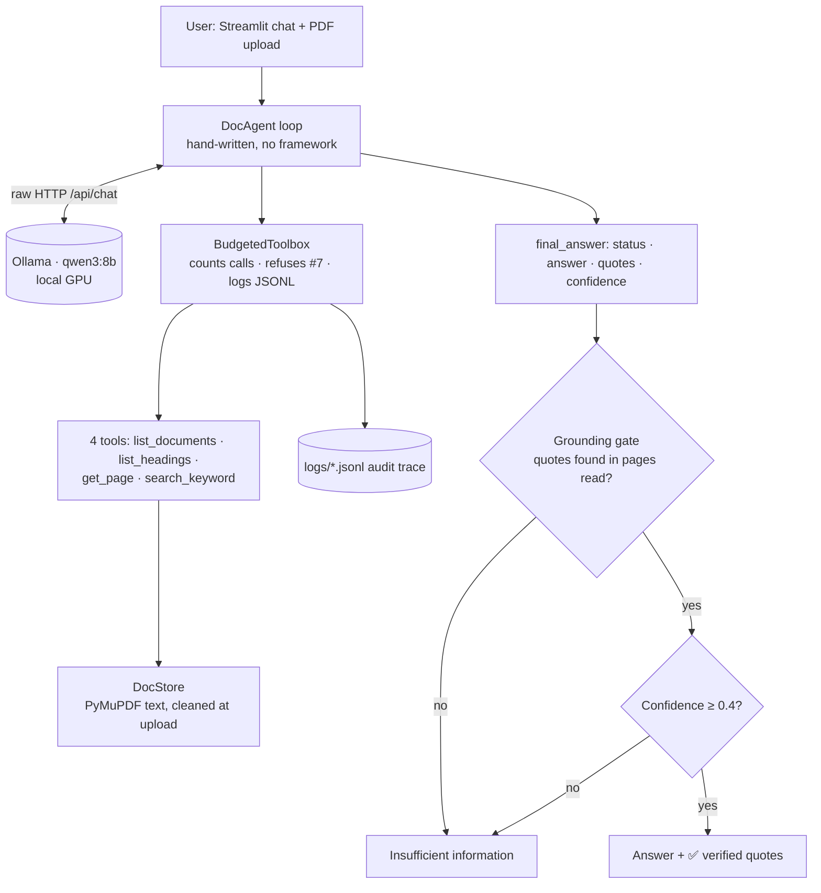

# PageProof — Pitch Deck Content (12 slides)

> For the slide builder. Each slide has a title, 3–5 bullets, a suggested visual and speaker notes.
> All numbers are generated from `logs/results_*.json` by `make_report.py`.

---

## Slide 1 — Title

**PageProof**
**A Budget-Bounded, Evidence-Verified Document Agent That Answers Only What the PDF Proves**

- *No RAG. No vector DB. Six tool calls. Every answer comes with a quote.*
- Runs fully local: Ollama + qwen3:8b on an RTX 5050 laptop GPU (8 GB).
- No document leaves the machine.
- Team: SOUL SOCIETY · RAP Hackathon 2026 · Track: Agentic Systems & Harness Design

**Visual:** Dark background with the PageProof wordmark. Show one PDF page icon with a green check stamp and a small "x/6" meter badge in the corner.

**Speaker notes:**
PageProof answers questions about any PDF you upload. It gets at most six tool calls per question, and it must prove every answer with a quote it actually read. If it can't prove an answer, it says "insufficient information". Everything runs on this laptop.

---

## Slide 2 — The Pain Point & Its Root Cause

- **One RAG pipeline per document set.** Chunking, embedding and re-indexing every time a policy changes. Indexes go stale without anyone noticing.
- **Hallucination.** Answers sound confident but come from model memory, not from the document.
- **Prompt injection.** Text inside a document can take over the agent ("ignore previous instructions…").
- **Unbounded agent cost.** Free-running agents loop, re-read pages and burn tokens, so cost and latency per question are unpredictable.
- **Root cause:** today's agents have **no cost bound** and **no proof attached to their answers**.

**Visual:** Four red "pain" tiles (pipeline, ghost or hallucination, syringe or injection, runaway meter) with arrows into one box labelled "Root cause: no budget + no proof".

**Speaker notes:**
Teams build a new embedding pipeline for every document set, and those pipelines drift out of date. The bigger problem is trust: you can't tell whether an answer came from the PDF or from the model's imagination, and you can't predict what a question will cost. We attack the root cause by bounding cost and requiring proof.

---

## Slide 3 — Target Users

- **Compliance, legal, HR and policy teams.** "What does clause 4.2 say after the 2025 amendment?" A wrong answer here is a liability.
- **Customer support.** Answers from product manuals and T&Cs, with a citation the agent can paste.
- **SMEs.** No ML team and no vector DB to run. Upload a PDF and ask.
- **Regulated and air-gapped organisations** (defence, healthcare, banking). Documents cannot leave the premises.
- **Edge deployments.** Field laptops and branch offices with one consumer GPU and unreliable internet.

**Persona:** *Priya, HR Compliance Lead at a 400-person firm.* She has 30 policy PDFs that are revised every quarter, and IT will not approve sending them to a cloud LLM. She needs answers she can forward to legal with the page and quote attached. When the policy is silent, she needs the tool to say so instead of inventing an answer.

**Visual:** Persona card for Priya (photo placeholder, goals, frustrations) with five small user-segment icons around it.

**Speaker notes:**
Our users care more about being right than being fast. They need to know where an answer came from, and they often can't use the cloud at all. Priya is the archetype: she needs a quote and a page number, and an honest "not in the document" is worth more to her than a confident guess.

---

## Slide 4 — Requirements → How We Meet Each Hard Constraint

| Hard constraint | How PageProof complies |
|---|---|
| No RAG, embeddings or vector DB | Only lexical keyword search, which returns page numbers. Nothing is embedded or indexed semantically. |
| Read only through the 4 tools | `list_documents`, `list_headings`, `get_page` (one page) and `search_keyword` (page numbers only). The LLM sees no other document text. |
| 6 tool calls per question + 1 answer | The **harness** enforces the budget, not the prompt. A 7th call is refused and never executed. Failed calls count. The final answer is a structured call that does not touch the document. |
| Must be able to say "insufficient information" | Explicit status, plus a grounding gate (quotes must match pages actually read), plus a confidence threshold of 0.4. |
| No agentic frameworks | A hand-written loop with raw HTTP to Ollama `/api/chat`. No LangChain, LangGraph, CrewAI or AutoGen. |
| Call logging and full trace | Every call (arguments and full result) goes to `logs/*.jsonl`. One-click trace download in the UI. |
| No pre-reading or caching | Each question starts empty. Only pages fetched by that question's calls are available to it. |
| Must generalise to an unseen PDF | Heading detection works without an embedded outline, using font size and weight. Text is cleaned of ligatures, hyphenation and lost spaces. |

**Visual:** The table above, with a green check in a narrow first column.

**Speaker notes:**
Every rule is enforced in code, not by asking the model nicely. The budget is a counter in the harness. Call seven cannot happen, because the harness refuses it before it runs. The trace logs every call with its full result, so judges can audit everything.

---

## Slide 5 — Architecture: Secure · User-Friendly · Centralised

- **Secure:** the LLM runs locally on Ollama, so no document or question leaves the machine. Page text is fenced with a random nonce (`<<<PAGE n id=…>>> … <<<END PAGE id=…>>>`), so a PDF cannot fake the end of the fence, and the system prompt treats it as data, never as instructions. No index, embedding or page cache is stored. The only file written is the local audit trace.
- **User-friendly:** a chat UI with a live **x/6 call meter**, answers with page-cited quotes marked ✅ verified or ❓ unverified, and plain-language "insufficient information" answers.
- **Centralised:** a multi-PDF workspace (`list_documents` routes between files) and one audit log covering every question and every call.
- **Harness, not framework:** a ~200-line loop, a budget wrapper, a grounding gate and a confidence gate.

**Visual:** Render the mermaid diagram. Draw a dashed "Your laptop / on-prem boundary" box around everything to show that nothing crosses it.

**Speaker notes:**
The model can only touch the document through four tools, and the budget wrapper sits between them. When the model finishes, its answer passes two gates. First, are its quotes really on pages it read? Second, is it confident enough? If either check fails, the user gets "insufficient information".

---

## Slide 6 — Existing vs Proposed Strategies

- **A. Naive ReAct (existing):** the LLM picks tools freely, with no gate. It often reads pages one after another and guesses.
- **B. Search-first (existing):** keyword search, then read the hit pages. Fast, but it misses answers spread across sections.
- **C. Outline-first plan-then-read (existing):** `list_headings`, then plan the page reads. Good structure, but it spends a call before finding any evidence.
- **D. PageProof hybrid (proposed):**
  - Turn 1 runs `list_headings` and `search_keyword` in parallel.
  - It reads at most 3 pages and keeps 1 call in reserve for contradictions or continuations.
  - **Decline check:** if the agent declines early, with budget left and search-hit pages still unread, the harness pushes back once and lists those pages.
  - **Grounding check:** if the agent cites quotes that are not on any page it read, the harness pushes back once and asks it to re-read and re-quote.
  - Both checks are one-time push-backs, and both appear as steps in the UI timeline and the trace.
  - Every answer then passes the grounding gate and the 0.4 threshold.

|---|---|---|---|---|---|---|---|---|---|
| A | 12/19 (63%) | 3.7 | 6 | 3/3 | 1/3 | 3/3 | 0 | 0 | 54 s |
| B | 5/7 (71%) | 3.9 | 5 | n/a | 2/2 | 0/2 | 0 | 0 | 48 s |
| C | 5/7 (71%) | 3.7 | 5 | n/a | 2/2 | 0/2 | 0 | 0 | 78 s |
| D | 14/19 (74%) | 4.2 | 6 | 3/3 | 1/3 (+ red-team 1/1) | 0/3 | 2 | 0 | 60 s |
| D final (all fixes + question fingerprinting) | 14/19 (74%) | 4.0 | 6 | 3/3 | 3/3 | 0/3 | 0 | 0 | 52 s |
| D on the same 7-question subset as B/C | 5/7 | | | | | | | | |
| D, final code (stronger 'never skip tools' re-prompt), injection questions only | 2/3 | | | | | 0/3 | | | |

*Real PDFs: course reader, US Constitution, 'Attention Is All You Need'. B and C were run on an evenly spread subset (every 3rd question) for time.*

*Model: qwen3:8b on Ollama. Dataset: 19 hand-labelled questions on real PDFs (single-page, multi-page, superseded, unanswerable). Injection is scored separately on a disclosed red-team fixture.*

**Visual:** Grouped bar chart of accuracy per strategy, with D highlighted. Put the table underneath.

**Speaker notes:**
We didn't just build one agent. We tested three established strategies against ours on the same model and the same questions. The hybrid wins because turn 1 gives it both a map (headings) and coordinates (search hits) for two calls. The reserve call is what catches "this was amended later" cases.

---

### Backup slide (after slide 6): "How PageProof decides" (the agent policy)

- **Evidence budgeting:** 2 calls locate, ≤ 3 read, 1 in reserve. It stops early when the evidence is verified (often 3/6 calls).
- **Negative-evidence check:** "not in the document" must be earned. A decline is refused while unread search hits and budget remain.
- **Vocabulary discovery:** it retries with the document's own wording, with lexical partial-word fallback (finds "Peppert" for "Papert").
- **Two-stage gate:** quote found on a page read (0.8) **and** confidence ≥ 0.4, with one push-back to go and read before declining.
- **🧬 Question fingerprinting (new):** a zero-cost classifier routes each question: comparison means search both concepts, may-have-changed means hunt for the amendment, multi-part means one target per part. It costs no tool calls. Measured: injection questions went from 1/3 to 3/3 answered correctly; headline accuracy stayed 14/19.
- **Measured honestly:** two full runs of D both scored 14/19 but missed different questions, so multi-page and contradiction answers vary run to run on an 8B model.
- **Next:** an evidence-collision resolver for unmarked contradictions (the Congress meeting-day question has no temporal cue, so fingerprinting cannot route it).

**Speaker notes:** "The four tools are fixed for everyone. Our innovation is how the agent decides what to ask them and when to stop, and that the harness, not the model, enforces each of those decisions."

---

## Slide 7 — Our Thresholds and Why We Chose Them (Data, Not Guesswork)

PageProof decides **answer vs "insufficient information"** with two thresholds. We picked both values from our own logged traces.

**1. Grounding gate = 0.8 (the decisive one).** At least one quote must appear verbatim on a page the agent read in this question, *or* ≥ 80% of its word 3-grams must match with every number present.
- **Why not higher (0.9 / 1.0 verbatim)?** It blocks correct answers whose quotes differ slightly from the page (match scores 0.85 and 0.96 in our runs). Verbatim-only loses 2 more correct answers.
- **Why not lower (0.5–0.7)?** It gains nothing (identical results on our data) and makes invented quotes easier to pass. 0.8 is the strictest value that keeps every correctly quoted answer.
- **Effect:** blocked 2 answers the model wrote from memory, including one where the document told it to "skip the tools".

| 3-gram threshold | Correct answers accepted | Correct answers wrongly blocked | Wrong answers accepted | Wrong answers blocked |
|---|---|---|---|---|
| 0.5 | 15 | 1 | 2 | 1 |
| 0.6 | 15 | 1 | 2 | 1 |
| 0.7 | 15 | 1 | 2 | 1 |
| 0.8 | 15 | 1 | 2 | 1 |
| 0.9 | 14 | 2 | 2 | 1 |
| 1.0 | 13 | 3 | 2 | 1 |

**2. Confidence = 0.4 (backstop).** Answer only if P(correct) > λ/(1+λ). 0.4 corresponds to a wrong answer costing about ⅔ of a right one. We measured that qwen3:8b reports 0.95–1.0 on *every* answer, including wrong ones, so this threshold rarely fires. That is exactly why we don't rely on confidence alone.

**Honest limit:** wrong answers can carry perfectly real but *outdated* quotes (contradiction cases). No quote threshold catches that, so contradictions are handled separately (latest amendment wins, plus a reserve call).

**Visual:** a line chart of "correct answers kept" and "wrong answers blocked" against the grounding threshold 0.5→1.0, with 0.8 marked as the knee.

**Speaker notes:**
"We didn't pick 0.8 from a blog post. We replayed every answer from our benchmark logs against the pages the agent actually read. 0.8 is the strictest setting that never rejects a correctly quoted answer. Anything stricter starts throwing away right answers. The confidence score turned out to be useless for this model, and we say so: it's always 0.95+."

---

## Slide 8 — Extra Features

- **Branded PageProof hero banner** with chips for the guarantees: 100 % local, ≤ 6 calls + 1 answer, no RAG and no page cache, quote-verified, injection-fenced.
- **Live 6-slot tool-budget meter.**
  - Slots fill call by call, and failed calls turn amber.
  - A dashed ✕ slot shows calls that were refused and never executed.
  - A "+1 answer" slot turns green when the final answer is submitted.
- **Tool-call timeline cards** show each call with its arguments and a short result. Self-correction steps are visible too:
  - 🔁 Decline check: a premature "insufficient" is pushed back once.
  - 🔁 Grounding check: unverified quotes are pushed back once.
- **Gate badges** on every answer:
  - ✓/✗ grounding gate
  - ✓/✗ confidence ≥ 0.4
  - calls used out of 6, and seconds taken
- **"🛡️ Injection blocked" banner.** When a page contains instructions aimed at the AI, PageProof ignores them and shows what it ignored.
- **Evidence quotes**, each with its page and a ✅ "verified on a page read" badge (❓ if not found). There is also a contradiction note: when a later amended or superseding statement wins, the old value is mentioned.
- **Transparency and practical features:**
  - Withheld tentative answer: when an answer fails a gate, the model's guess is shown, clearly labelled.
  - One-click full JSONL trace download.
  - **📊 Benchmark tab** that compares strategies A–D inside the app.
  - Scanned-PDF warning when there is no text layer.
  - Multi-PDF upload.
  - Fully offline: works with Wi-Fi off.

**Visual:** An annotated screenshot of the chat UI with callouts on the hero banner, the 6-slot meter, a 🔁 self-correction card, the gate badges, the ✅ quotes, the red injection banner, the 📊 Benchmark tab and the download button.

**Speaker notes:**
These features all serve the same goal: the user can see why to trust an answer. When the gates downgrade an answer, we don't hide the model's guess. We show it, clearly labelled as withheld, so a human can decide. And the full trace is one click away.

---

## Slide 9 — Business Model

- **SaaS tiers** plus **Enterprise on-prem**, and **pay-per-question** for occasional users.
- **Predictable unit cost.** Every answer is capped at **6 tool calls + 1 answer call**, so the worst-case cost per question is known in advance.
- **Local inference means near-zero marginal cost.** One consumer GPU serves a team, with no per-token API bill.
- **Measured:** average 4.0 tool calls and 52 s per question on an RTX 5050 laptop.

**Illustrative pricing (example only, not validated with customers):**

| Tier | Price (illustrative) | Includes |
|---|---|---|
| Free | $0 | 1 user, 3 PDFs, 50 questions/month, local only |
| Team | $15 / user / month | Multi-PDF workspaces, shared audit log, trace export |
| Enterprise (on-prem) | Annual licence, from $10k / year | Air-gapped install, SSO/RBAC, connectors, support SLA |
| Pay-per-question | $0.02 / question | Hosted GPU, same 6-call cap, so the price is fixed |

**Visual:** Three pricing cards plus a small "cost per question" gauge showing the fixed cap of 7 LLM-facing calls.

**Speaker notes:**
The budget is a product feature, not just a hackathon rule. Because no question can exceed seven calls, we can quote a fixed price per question. Running locally means the marginal cost is electricity. These prices are illustrative and have not been validated with customers.

---

## Slide 10 — Scale-Up Roadmap

- **OCR for scanned PDFs.** Add a text layer so `get_page` and `search_keyword` work on scans.
- **SSO / RBAC.** Per-team document workspaces and audit-log access control.
- **Connectors.** SharePoint and Google Drive, fetched on demand per question with no pre-indexing, so the no-caching rule still holds.
- **Slack / Teams bot.** Ask in the channel and get the answer with quotes and a trace link.
- **Multilingual and GPU deploy.** Multilingual search and prompts. One-click GPU cloud (e.g. Zerops with a GPU host) or on-prem appliance.

**Visual:** A horizontal timeline in three phases: Now (local app) → Next (OCR, SSO, connectors) → Later (bots, multilingual, cloud/on-prem appliance).

**Speaker notes:**
The core harness doesn't change as we scale. Connectors fetch pages on demand inside the same budget, so we never need a vector index. We'd deploy on a GPU host rather than a CPU container, because an 8B model on CPU takes minutes per answer.
We did not cloud-deploy for the hackathon, for three reasons:
- Typical PaaS has no GPU.
- Running locally is the privacy story itself: no document leaves the machine.
- A local demo can't fail on Wi-Fi or a cold start.

GPU cloud and on-prem deployment are on the roadmap.

---

## Slide 11 — Research Basis

- **ReAct**, Yao et al., ICLR 2023. Interleaved reasoning and tool actions. This is our loop, but bounded to 6 actions and gated before answering.
- **Toolformer**, Schick et al., NeurIPS 2023. LMs can learn when and how to call APIs. We expose 4 narrow tools with strict schemas so a small local model can call them reliably.
- **SQuAD 2.0: "Know What You Don't Know"**, Rajpurkar, Jia & Liang, ACL 2018. Abstaining on unanswerable questions is a core skill. This is the basis for our first-class "insufficient information" status.
- **Indirect Prompt Injection, "Not what you've signed up for"**, Greshake et al., AISec '23 (ACM). Retrieved data can hijack LLM apps. We fence page text as untrusted data and report embedded instructions.
- **SelfCheckGPT**, Manakul, Liusie & Gales, EMNLP 2023. Detects hallucination without external resources. We use a cheaper, deterministic check: every quote must appear in pages actually read.
- **Lost in the Middle**, Liu et al., TACL 2024 (doi:10.1162/tacl_a_00638). Long contexts bury facts. We read at most a few targeted pages instead of stuffing the document into the prompt.
- **Unifying LLMs and Knowledge Graphs: A Roadmap**, Pan et al., IEEE TKDE 36(7), 2024 (doi:10.1109/TKDE.2024.3352100). LLMs are black boxes that recall facts unreliably and need explicit external knowledge. We use the document's own structure (headings, pages) as that explicit source, with no embeddings.

**Visual:** Seven small citation cards, each with a one-line "→ PageProof design choice" arrow underneath.

**Speaker notes:**
Each design choice traces back to published work. We verified every citation's authors, venue and year. The novel part is the combination: a hard budget, a deterministic grounding check and abstention, running on a laptop.

---

## Slide 12 — Honest Limits & Next Steps

- **Multi-hop answers can exceed 6 calls** when the answer spans more than 4 pages. *Next:* smarter page choice from headings, and read the next page only when text is cut mid-sentence.
- **Math- and figure-heavy pages** extract badly, so correct quotes can fail verification and get downgraded. *Next:* relaxed matching for math pages, and OCR.
- **Heading detection is heuristic.** Divider pages create pseudo-headings, and scanned PDFs have no text layer. *Next:* an OCR and layout model.
- **Confidence is self-reported** and poorly calibrated, and the threshold was tuned on a small set. *Next:* calibrate on a larger held-out set.
- **Printed page and section numbers can repeat** in stitched PDFs, so questions citing printed pages can be mislocated. *Next:* map printed page labels to PDF indexes.

**Visual:** A two-column table, "Known failure mode" and "Planned fix", with an amber warning icon per row.

**Speaker notes:**
We'd rather tell you where PageProof breaks than have you find out in the demo. Each limit has a concrete fix, and none of them needs RAG or a bigger budget. Questions are welcome. The full trace of today's live demo is in the download.
